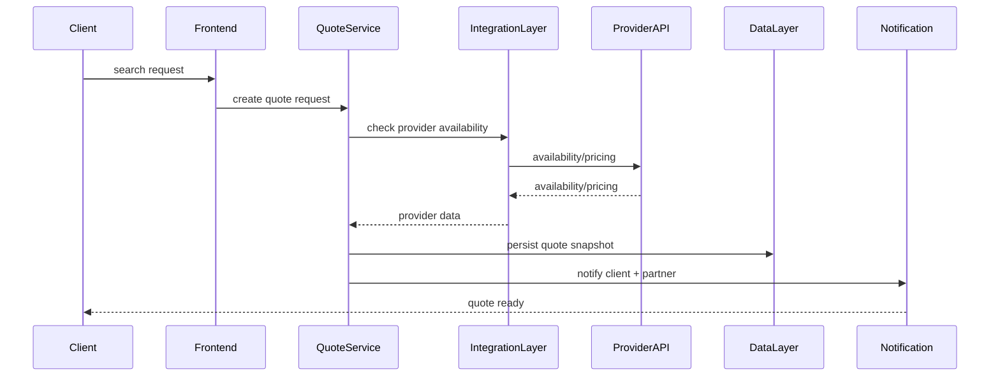
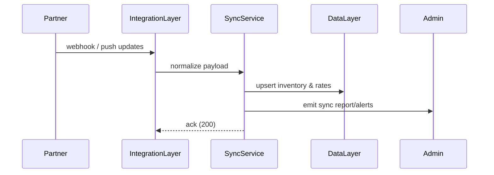
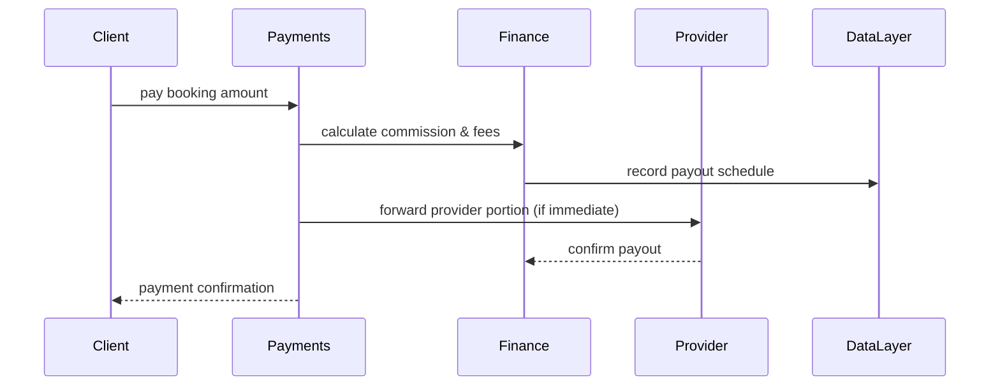

# CollEco Travel — System Architecture Overview

Date: 2025-10-17

This document captures a concise system architecture, role map, authentication model, integrations, data flow, and multi-role experience model for CollEco Travel.

## 1. Application Layers

Layer | Description | Key Technologies
---|---:|---
Presentation Layer (Frontend) | User-facing web & mobile interfaces for all roles. | React + Tailwind (Web), React Native (Mobile), PWA support
Application Layer (Backend Logic) | Handles auth, RBAC, booking logic, pricing, commissions, notifications. | Node.js / Express or NestJS
Integration Layer (APIs & Connectors) | Connects external systems — hotels, flights, payments, etc. | REST / GraphQL, RapidAPI integrations, CollEco API
Data Layer (Storage & Management) | Stores users, bookings, partners, pricing, itineraries, documents. | PostgreSQL (primary), Redis (cache), S3 (media/docs), Firebase (push)
Intelligence & Analytics Layer | AI assistant, recommendations, dashboards. | OpenAI API, TensorFlow (or TF Lite for edge), PowerBI / BI tools

## 2. System Role Map & Core Access Zones

### A. ADMIN (CollEco Team)

Central command role with system-wide oversight.

Main modules
- Dashboard (KPIs, revenue, bookings, partner activity)
- Partner Management (approve/reject, verify documents)
- Product Oversight (listings, sell-on-behalf)
- Financials (commissions, payouts, reports)
- Compliance & Safety (document expiration alerts)
- User Support & Escalation
- Content & Promotions
- System Settings & Roles Control

### B. PARTNER (DMCs / Tours / Lodges / Product Owners)

Sub-roles: API-Connected Partner, Manual / Sell-on-Behalf Partner, Hybrid Partner.

Core tools
- Partner Dashboard (bookings, calendar, stats)
- Product Management (create/edit listings)
- Financials (earnings, payouts, invoices)
- Messaging Hub (chat)
- Compliance Center (document uploads)
- Marketing Tools (promo codes, featured listings)

### C. CLIENT (Traveler / Corporate)

Core tools
- Explore & Book (search, filter, compare)
- Quotes & Itineraries (view, approve, pay)
- Personal Dashboard (bookings, payments, rewards)
- Smart Assistant (AI-powered trip planning)
- Reviews & Feedback
- Notifications & Alerts

Extended features
- Influencer Mode (post content, earn referrals)
- Collaborative Mode (chat with agents/partners)

### D. INFLUENCER / CREATOR

(Toggled on top of Client account; not a separate login)

Core features
- Upload travel content (photos, reels, blogs)
- Earn via referrals and affiliate links
- Analytics (views, engagement, conversions)
- Brand collaborations & sponsored trips

### E. ADMINISTRATIVE SUPPORT / FINANCE SUBROLE

(Scoped within Admin role)

Core tools
- Payment gateway management
- Escrow release scheduling
- Accounting sync (Sage/QuickBooks or internal ledger)
- Payout scheduling
- Reports export (PDF/Excel)

## 3. Authentication & Access Management

- OIDC / OAuth2.0 — support login via email, Google, or other social logins
- RBAC — dynamic role assignment and permission control
- JWT Tokens + Refresh Tokens — secure session handling and rotation
- Multi-tier access control — UI visibility and action locking per role/sub-role
- Partner verification gate — partners are locked/restricted until required docs verified

## 4. Key Integrations

Integration Type | Examples / Purpose
---|---
Flight APIs | Amadeus, Duffel, Skyscanner, Travelport
Accommodation APIs | Booking.com, Expedia Partner, Hotelbeds
Car Hire APIs | Rentalcars, Carnect
Payment Gateways | Paystack, Stripe, Peach Payments
Exchange Rate API | CurrencyLayer, Fixer.io
Notifications | Firebase Cloud Messaging (push), Twilio (SMS)
Calendar Sync | Google Calendar sync for itineraries and reminders
AI / Chat Assistant | OpenAI / custom LLM adapters for Smart Assistant

## 5. Data Flow Summary (Example: Client searches & quotes a tour)

1. User action (Client searches for tour) on frontend.
2. Frontend request → Backend quote-builder microservice.
3. Backend logic: check pricing rules, cached availability, fees, and business rules.
4. Integration layer: fetch external provider availability/prices if partner is API-connected.
5. Data layer: save quote, link to itinerary draft, persist pricing snapshot.
6. Notification engine: send quote ready notification (email/push/SMS) to client & partner.
7. Finance layer: calculate commission & service fee split; mark pending payment items.
8. Analytics layer: log event, update dashboards (Bookings funnel, conversion metrics).

### Booking flow (Mermaid sequence diagram)



## 6. Multi-Role Experience Model

User Type | App Mode | Example
---|---|---
Partner (Sell-on-Behalf) | Manual listing mode | Lodge uploads room rates; CollEco sells & updates.
API Partner | Automated sync | Tour operator connected to API; updates auto-reflected.
Client + Influencer | Dual profile | Client books trip, later posts vlogs and earns referral revenue.
Admin + Finance Staff | Sub-role access | Admin manages partners; finance staff view restricted reports.

## 7. Deployment & Operational Considerations

- Infrastructure: Containerized services (Docker) orchestrated on Kubernetes (EKS/GKE/AKS) or managed App Platform.
- Zero-downtime deploys: rolling updates, canary releases for new pricing/commission logic.
- Observability: Prometheus + Grafana, ELK/Opensearch for logs, Sentry for error tracking.
- Backups & DR: periodic DB snapshots, point-in-time recovery for PostgreSQL, object storage replication for S3.
- Security: encrypt-at-rest (DB), TLS everywhere, WAF for public endpoints, rate-limiting for integrations.

## 9. Component & Deployment Diagram

Below is a component/deployment overview illustrating service boundaries, scaling points, and external integration zones. Rendered as a Mermaid graph.

```mermaid
graph TB
	subgraph Frontend
		Web[Web App (React + PWA)]
		Mobile[Mobile App (React Native)]
	end

	subgraph Edge
		CDN[CDN / Static Hosting]
		APIGW[API Gateway]
	end

	subgraph Backend
		Auth[Auth Service (OIDC / JWT)]
		Quote[Quote Service]
		Booking[Booking Service]
		Partner[Partner Sync Service]
		Payments[Payments Service]
		Notifications[Notification Service]
		Admin[Admin API]
	end

	subgraph Data
		Postgres[(PostgreSQL)]
		Redis[(Redis Cache)]
		S3[(S3 / Object Storage)]
		Analytics[(Analytics / Data Warehouse)]
	end

	subgraph External
		Providers[Providers (Hotels / Flights / Cars)]
		PaymentGateway[Payment Gateways]
		Twilio[Twilio / Firebase]
	end

	Web --> CDN --> APIGW
	Mobile --> APIGW
	APIGW --> Auth
	APIGW --> Quote
	APIGW --> Booking
	APIGW --> Partner
	APIGW --> Payments
	APIGW --> Notifications
	APIGW --> Admin

	Quote --> Postgres
	Booking --> Postgres
	Partner --> Postgres
	Payments --> Postgres
	Notifications --> Postgres
	AnyCache[Redis] <-->|cache| Quote
	AnyCache <-->|cache| Booking
	AnyCache <-->|cache| Partner

	Partner --> Providers
	Booking --> PaymentGateway
	Payments --> PaymentGateway
	Notifications --> Twilio
	S3 --> Postgres
	Analytics --> Postgres

	classDef infra fill:#f9f9f9,stroke:#333,stroke-width:1px
	class Frontend,Backend,Data,Edge,External infra
```

Notes:
- API Gateway (or edge service) handles routing, authentication, rate-limiting, and can host feature flags.
- Backend services are microservice candidates: Quote, Booking, Partner Sync, Payments, Notifications, Auth.
- Postgres is the primary source of truth; Redis is used for caching; S3 for media/docs; Analytics ingests events for dashboards.
- Each backend service should be containerized and horizontally scalable with a readiness probe and resource limits.

## 8. Next Steps & Recommended Roadmap

1. Finalise high-value integrations (payments, top-3 accommodation/flight APIs) and create integration adapters.
2. Define a partner onboarding flow (API vs manual) and the document verification lifecycle.
3. Design data contracts for quote snapshots and payout calculations; add E2E tests for finance flows.
4. Add diagrams: sequence diagrams for booking/payout, and component diagram for services.
5. Implement RBAC + feature-flagging for staged rollout of Influencer and Collaborative modes.

---

If you'd like, I can:
- add Mermaid diagrams to this doc (booking flow, partner sync),
- expand the integrations section with specific API endpoints and sample payloads, or
- scaffold a docs/diagrams folder with .mmd files.

### Partner sync (Mermaid sequence diagram)



### Payment split (Mermaid sequence diagram)


